# Interconnect
Interconnect is a telecom company exploring predictions of when a clients would leave. Discovering the at risk of leaving clients the company plans to ffer them incentives to stay. 

🔗 Interconnect – Data Analysis & Visualization

This project explores patterns, connections, and trends within a dataset referred to as Interconnect. It includes exploratory data analysis, correlation mapping, and visualization to better understand the structure and insights hidden in the data.

📚 Table of Contents
About the Project

Installation

Usage

Project Structure

Technologies Used

Results & Insights

Screenshots

Contributing

License

📌 About the Project
This notebook covers:

Cleaning and preparing tabular datasets

Exploratory visualizations and heatmaps

Distribution analysis and feature comparison

Time series insights and clustering (if applicable)

Clear summary visuals of trends and correlations

🛠 Installation
bash
Copy
Edit
pip install pandas numpy matplotlib seaborn jupyter
Then launch with:

bash
Copy
Edit
jupyter notebook
🚀 Usage
Open the file Interconnect.ipynb in Jupyter Notebook and run all cells in sequence. You’ll walk through:

Data loading and preprocessing

Statistical summaries and visual correlation

Multiple layered plots for exploratory analysis

📁 Project Structure
bash
Copy
Edit
Interconnect.ipynb                    # Main notebook
images_interconnect/                  # Screenshot folder
README.md                             # This file
⚙️ Technologies Used
Python 3.8+

Pandas

NumPy

Matplotlib

Seaborn

Jupyter Notebook

📊 Results & Insights
Example takeaways (you can customize this):

Features X and Y show a strong positive correlation

Outliers in variable Z affect group segmentation

Weekday and time-of-day analysis suggests usage peaks in afternoons

📸 Screenshots
markdown
Copy
Edit
### 📈 Sample Data Distribution  
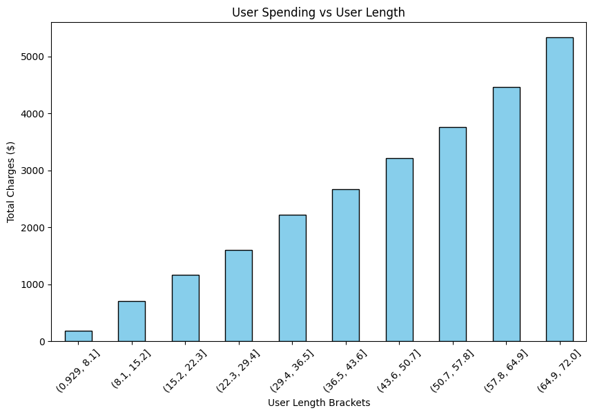

### 📊 Correlation Heatmap  
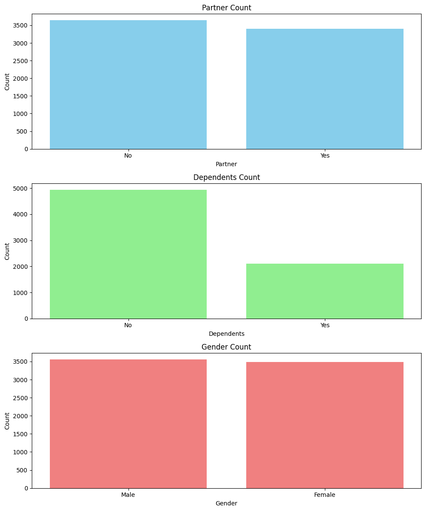

### 📉 Line Trends  
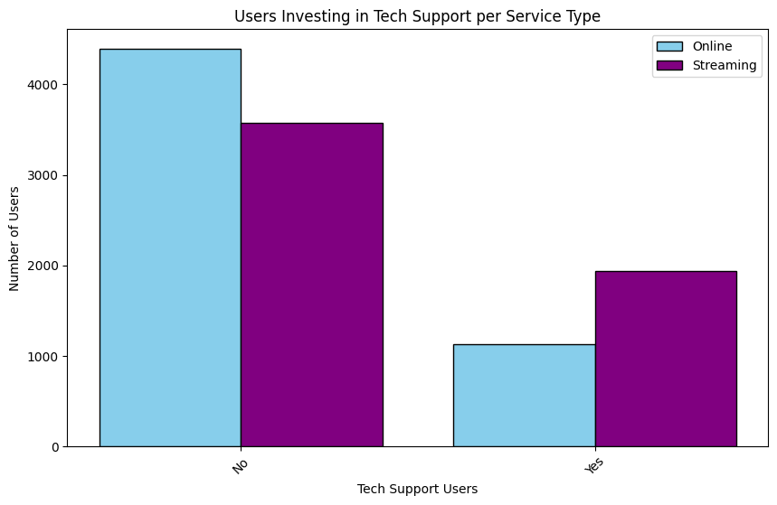

### 📦 Feature Histogram  
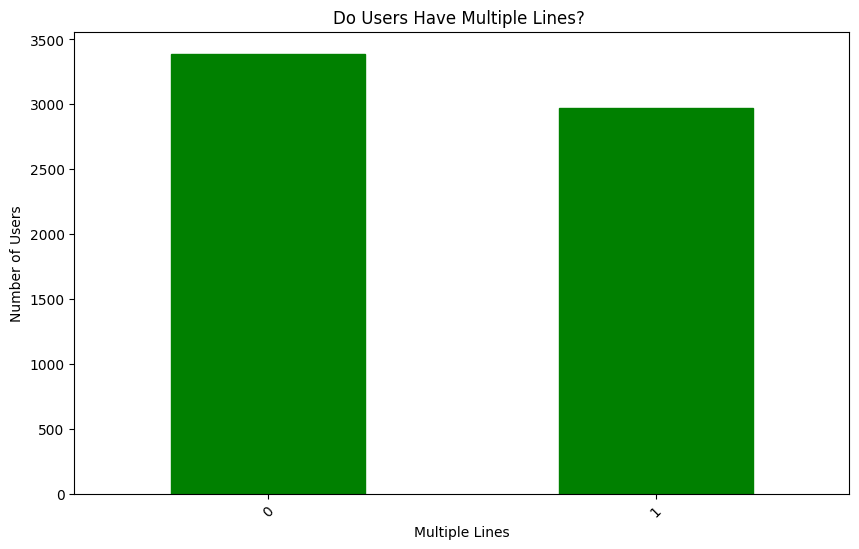

### 📌 Boxplot by Category  
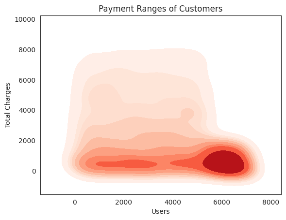

### 🌀 Pairwise Relationships  
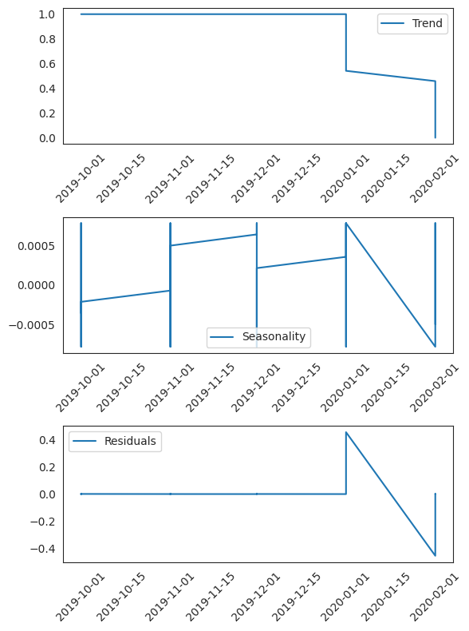

### 📍 Scatter Plot Matrix  
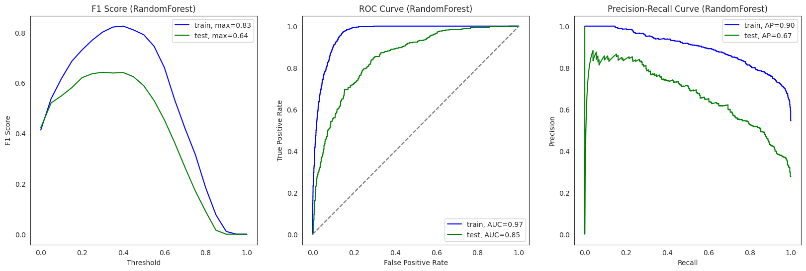

### 📊 Trend Comparison  
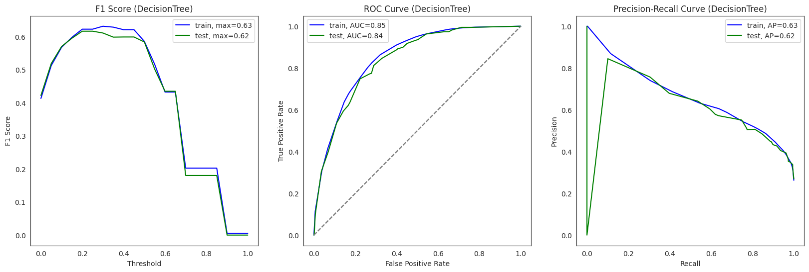

### 📈 Rolling Average Visualization  
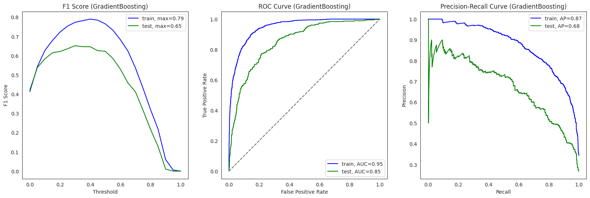

### 📊 Categorical Analysis  
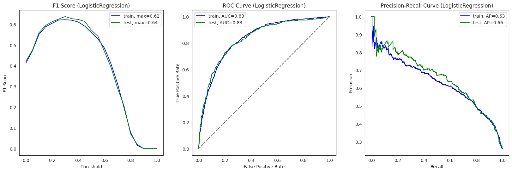

### 🔁 Residual Diagnostics  
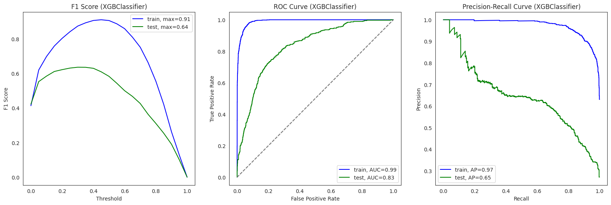

### 💹 Final Insight Chart  
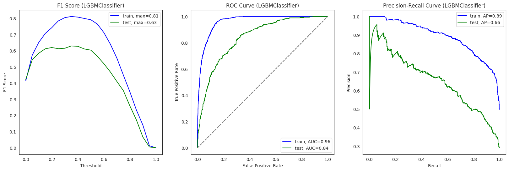

### 🧠 Summary Plot  
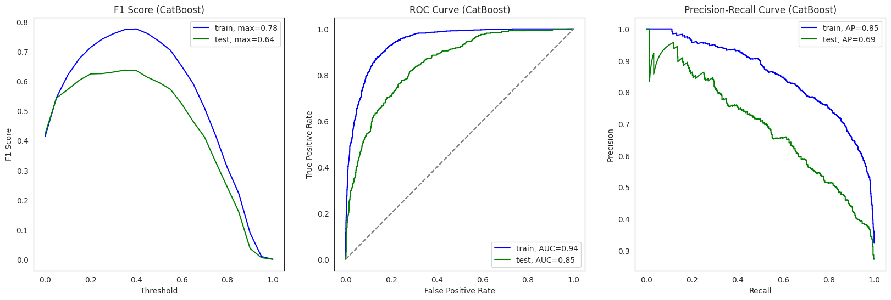

Interconnect now has a successful model to discover the users at risk of leaving.

Analyzing the data provided some interesting insights. Data provided was from earliest customer on 2013-10-01 to 202-02-01. Average time of a customer was 32.42 months. Average user spent $2,036 in total charges. However, the longer a user was a customer the more they paid in total charges.User data provided was equally split between male and female. In given informatio majority of users (around 5k) do not have dependents. Yet nearly half of users have multiple lines on their accounts. Perhaps an indication that majority of users have business lines. Overall most users (around 8k) did not elect for any type of tech support (security or backup). Streaming customrs are more likely to invest in tech support over online customers.

Following models were evaluated: Random Forest, Decision Tree, Gradient Boosting, Logistic Regression,XGB, LGBM, and CatBoost. Results listed below are arranged per model listed above on the test model. AUC-ROC was .84,.84,.85,.83,.83,.84,.85. Precision was .62,.62,.68,.66,.65,.66,.69. Accuracy was .80,.80,.82,.80,.79,.80,.81. F1 score was .58,.58,.62,.57,.58,.60,.60. Overall ranking of models to predict based on ROC would be GradientBoosting and CatBoost tied as the best. Second place is a three way tie with Random Forest, LGBM, and Decision Treel. Tied for third most effective is XGB and Logisitc Regression.

Chose to evaluate with AUC-ROC, F1, Accurary, and Precision-Recall to see which would be the best measurment. F1 Score balances precision and recall by penalizing extreme values. F1 does not differentiate between false positives and false negatives at an alarmingly high rate. So we would not want to use. In our data we balanced between customers who had churned and customers who had remained. Precision-Recall Curve measures the trade-off between Precision and Recall at various thresholds. Works best on highly imbalanced datasets so it is not good for our data. Accuracy measures the percentage of correctly classified instances. Best for a balanced dataset (such as ours). ROC Curve measures the trade-off between True Positive Rate (TPR, Sensitivity/Recall) and False Positive Rate (FPR) at various classification thresholds. The closer to 1 indicates a perfect model (highest achieved by Gradient Boosting at .85). Either accuracy or AUC-ROC could be used to measure the success of the model. Ranking of models is mostly same between accuracy or AUC-ROC. Only note is that in using accuracy XBG joins second place to make a four way tie.

🤝 Contributing
If you’d like to extend this project or automate more insight generation, feel free to fork and submit a pull request.

🪪 License
Licensed under the MIT License

